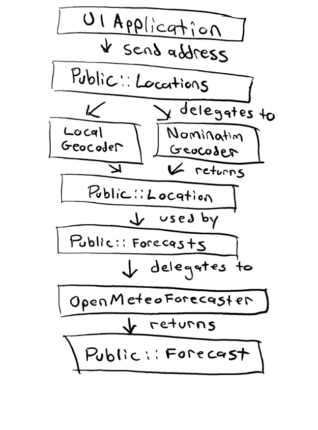

# Weather App

A Rails application that takes a user-provided address and forecasts the weather for that location.

## Overview

The application will first attempt to geocode an address using two strategies:

1. First, it will attempt to use [OpenStreetMap's Nominatim API](https://nominatim.openstreetmap.org/ui/search.html).
2. If that fails, it will lookup locally stored US postal codes.

Once a location is found, the app will pass it along to [Open Meteo](https://open-meteo.com/en/docs) to fetch the weather forecast.

## Technologies

- Ruby 3.1.2
- Rails 7.2.2.1
- Dry-rb libraries for type safety
- No database required

## Installation

```bash
# Clone the repository
git clone https://github.com/amrani/weather-app.git

# Install dependencies
bundle install

# Optional (enable local cache)
rails dev:cache

# Start the server
rails s
```

## Storage

This application does not have an installed database. However, it does have a JSON file of US zipcodes from [geonames](https://download.geonames.org/export/zip/). It also utilizes `Rails.cache`.

## Live Demo

A [live demo](https://weather-app-25-2aded273bed9.herokuapp.com/) deployed using Heroku.

## Object Decomposition



### Key Objects

- **Weather UI Application**: Handles user input and display of weather information
- **Public::Locations#fetch**: A public interface for our application to use to call operations for locations.
- **Public::Forecasts#fetch**: A public interface for our application to use to call operations for locations.
- **LocalGeocoder & NominatimGeocoder**: Services that convert addresses to coordinates
- **OpenMeteoForecaster**: Service that fetches forecast data from OpenMeteo API
- **Public::Forecast**: Data object containing current, hourly and daily forecasts
- **Public::Location**: Data object containing position, name, and zip

## Testing

The application uses RSpec. You can run the test suite with:

```bash
bundle exec rspec spec
```